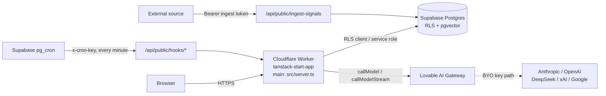
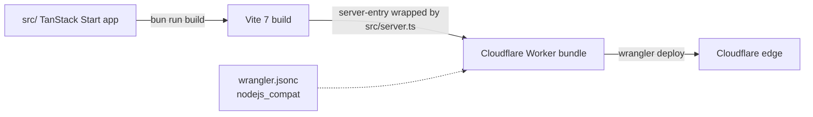
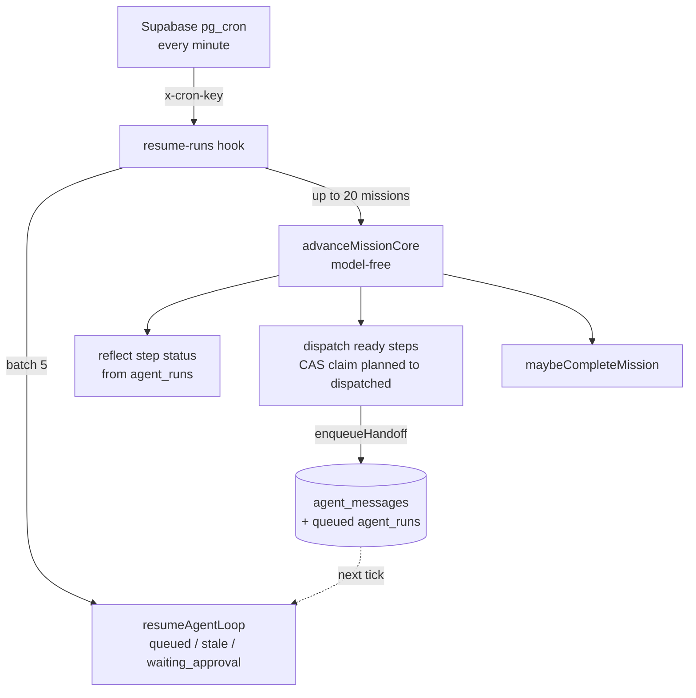
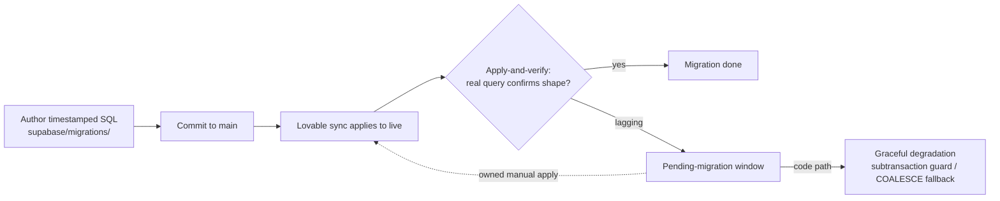

# architecture/deployment.md: Deployment and operations contract

> _Created: 2026-06-14 · Last updated: 2026-06-19_

> **What this is.** How Cadence gets from source to a running production system, and how it is kept running. Build path, runtime topology, secrets, the per-minute cron loop, the migration model, environments, rollback, and the known operational risks. Rules: [`AGENTS.md`](../AGENTS.md). Strategy canon: [`../docs/strategy/v7-agentic-product-os.md`](../docs/strategy/v7-agentic-product-os.md). The AI chokepoint it deploys: [`runtime.md`](./runtime.md). The data layer it deploys: [`data.md`](./data.md). The mission engine the cron drives: [`orchestration.md`](./orchestration.md).

This doc does not restate the chokepoint or the schema. It covers the wiring around them: how the worker is built, where secrets live, what runs on a schedule, and how a migration reaches the live database. Where a claim touches an unfinished part of the system, it is marked **Built**, **Partial**, or **Missing/Planned** so the operational picture never outruns the wiring (the §13 founder ruling).

---

## 1. The shape of the system

One worker, one database, one gateway. Cadence is a single Cloudflare Worker that serves SSR React and the API routes, talks to a hosted Supabase Postgres over the wire, and reaches models through the Lovable AI gateway. The cron loop that makes the agent loop run itself lives in Supabase `pg_cron`, calling back into the worker's hook routes once a minute.

The browser only ever talks to the worker. The worker holds every secret. The database enforces tenancy with RLS on the user's own client, and the service-role client is used only inside cron hooks and the connector credential chain. Detail on the chokepoint: [`runtime.md`](./runtime.md). Detail on RLS and the schema: [`data.md`](./data.md).

---

## 2. Build and deploy path (Built)

**Package manager / runner: Bun.** `bun.lock` and `bunfig.toml` are canonical; the lingering `package-lock.json` is not.

**Build tool: Vite 7** with the TanStack Start plugin. The build emits a Cloudflare Worker bundle.

| Command | What it does |
|---|---|
| `bun install` | Install deps under the supply-chain guard (§4). |
| `bun run dev` | Vite dev server. Use this to verify UI changes. |
| `bun run build` | Production build: Vite to Cloudflare Worker bundle. |
| `bun run build:dev` | Same pipeline, dev-mode build. |
| `bun run preview` | Serve the built worker locally (a real worker, not the dev server). |
| `bun run lint` / `bun run format` | ESLint / Prettier. |

**`wrangler.jsonc`** is the deploy manifest: `name: "tanstack-start-app"`, `compatibility_date: "2025-09-24"`, `compatibility_flags: ["nodejs_compat"]`, `main: "src/server.ts"`.

**`src/server.ts` is the load-bearing SSR entry.** It wraps `@tanstack/react-start/server-entry`. h3 (the underlying HTTP layer) swallows in-handler 500s into a JSON body shaped `{unhandled:true, message:"HTTPError"}`, which a plain `try/catch` never sees. `normalizeCatastrophicSsrResponse` detects that exact pattern and renders a branded error page via `renderErrorPage()` instead of leaking the raw shape. `consumeLastCapturedError()` in `src/lib/error-capture.ts` surfaces the original error so the worker log keeps the real cause. Treat this file as part of the deploy contract: a change here changes how every uncaught server error is presented.

**The `.server.ts` convention is a build-time boundary, not a runtime check.** Files suffixed `.server.ts` are compiled into the worker only and never bundled to the browser. Importing one from a client component fails the build. The load-bearing server-only files: `runtime.server.ts`, `loop.server.ts`, `mission-advance.server.ts`, `handoff.server.ts`, `memory.server.ts`, `trust.server.ts`, the connector `resolve.server.ts`, and the service-role `client.server.ts`. This is the mechanism that keeps `SUPABASE_SERVICE_ROLE_KEY` and `LOVABLE_API_KEY` out of the client bundle.

**Routing is file-based** in `src/routes/`. `routeTree.gen.ts` is generated by the router plugin during build. Never hand-edit it.

---

## 3. Runtime topology (Built)

**The worker process.** One Cloudflare Worker runs both the SSR app and every `src/routes/api/*` server route in the same edge process. It is stateless between requests. Anything that must survive a request (mission state, loop checkpoints, budgets) lives in Postgres, not in worker memory. This matters for the loop: a worker can be evicted mid-step, and resume relies on the checkpoint in `agent_run_checkpoints` plus idempotency keys, not on any in-process state. Mechanics of that resume: [`orchestration.md`](./orchestration.md).

**The database.** Supabase hosted Postgres with RLS, pgvector for embeddings, and pg_cron for the schedule. Two access paths from the worker: the user's RLS-scoped client for all loop and tool execution, and `supabaseAdmin` (service role, RLS-bypassing, in `src/integrations/supabase/client.server.ts`) used only by cron hooks and the connector credential chain. The RLS contract is the tenancy boundary, documented in [`data.md`](./data.md) and [`security.md`](./security.md).

**The model path.** Every AI call goes through `callModel` or `callModelStream` in `runtime.server.ts`. Provider routing is three tiers checked in order: an explicit `byoOverride` (test use), a BYO key from `user_api_keys` when the model prefix matches a known provider, then the Lovable AI gateway with `LOVABLE_API_KEY`. Local dev has one fallback: if `LOVABLE_API_KEY` is absent and the model starts `google/`, it routes to Google's OpenAI-compatible endpoint with `GEMINI_API_KEY`. The chokepoint contract is [`runtime.md`](./runtime.md).

---

## 4. Secrets and environment (Built)

The single most important operational rule: secrets never reach the client bundle. The split is enforced by the `VITE_` prefix.

**Client-side (Vite prefix, safe to ship in the browser bundle):**

- `VITE_SUPABASE_URL`
- `VITE_SUPABASE_PUBLISHABLE_KEY`

**Server-side (wrangler secrets, never `VITE_`-prefixed):**

- `SUPABASE_URL`, `SUPABASE_PUBLISHABLE_KEY`, `SUPABASE_SERVICE_ROLE_KEY`. The service-role key bypasses RLS and is the most sensitive value in the system.
- `LOVABLE_API_KEY`. The gateway credential that pays for inference when a user has not brought their own key.
- `GEMINI_API_KEY`. Local-dev fallback only.
- `GITHUB_TOKEN` / `GITHUB_REPO`. Legacy env fallback for GitHub tools (deprecated; the connector chain is preferred).
- `GITHUB_APP_ID` / `GITHUB_APP_CLIENT_ID` / `GITHUB_APP_CLIENT_SECRET` / `GITHUB_APP_PRIVATE_KEY` / `GITHUB_APP_SLUG`. The GitHub App, used to mint short-lived installation tokens.
- `FIRECRAWL_API_KEY`. Web search, fetch, and crawl infrastructure (platform infra, never shown in UI).
- The connector OAuth client ids: `LINEAR_APP_USER_CONNECTOR_CLIENT_ID`, `GOOGLE_APP_USER_CONNECTOR_CLIENT_ID`, `NOTION_APP_USER_CONNECTOR_CLIENT_ID`, `FIGMA_APP_USER_CONNECTOR_CLIENT_ID`, `ATLASSIAN_APP_USER_CONNECTOR_CLIENT_ID`, `MICROSOFT_APP_USER_CONNECTOR_CLIENT_ID`.

**Never add a `VITE_` prefix to a secret.** The prefix is what tells Vite a value is browser-safe; prefixing a secret ships it to every visitor. The only publishable key with the prefix is the Supabase anon key, which is designed to be public and is paired with RLS.

**Pasted connector secrets** that a provider still requires are encrypted at rest with AES-256-GCM in `connection_secrets` (ciphertext + iv + key version), decryptable only by the service role through `crypto.server.ts`. Per the founder OAuth-only ruling, user-facing connectors are Connect-button OAuth, so this path is mostly legacy. Connector detail: [`integrations.md`](./integrations.md).

**The supply-chain guard.** `bunfig.toml` sets `minimumReleaseAge` to a 24h hold: a freshly published package version cannot be installed until it has aged 24 hours, which blunts the install-a-malicious-version-the-hour-it-drops attack. Do not add to `minimumReleaseAgeExcludes` without asking the user. This is a standing rule, not a default.

---

## 5. The cron loop (Built)

This is what makes the agent loop run itself. Supabase `pg_cron` calls the worker's hook routes on a schedule. The deterministic, model-free advance (`advanceMissionCore`) plus the run sweeper is what lets a multi-wave mission progress past wave 0 unattended. This is the real autonomy engine the v7 canon verifies, not a claim.

**Hook auth.** Every hook is gated by `requireHookCaller`, which matches an `apikey`, `x-cron-key`, or Bearer header against `SUPABASE_PUBLISHABLE_KEY`. The anon key shipped in the browser bundle doubles as the shared secret between pg_cron and the worker. Hooks run with `supabaseAdmin` (service role) because they act across users.

| Hook | Schedule | What it does | State |
|---|---|---|---|
| `resume-runs` | `* * * * *` (every minute) | Promotes queued / stale / waiting_approval runs (batch 5) via `resumeAgentLoop`; then calls `advanceMissionCore` on up to 20 running missions (reflect step status, dispatch ready steps via CAS claim, finalize). The heart of the loop. | Built |
| `approvals-tick` | `* * * * *` | Executes approved gated tool calls; notifies on denials. | Built |
| `event-reactor-tick` | `* * * * *` | Drains `event_queue` rows with `approval_mode='auto'` (batch 10); dispatches each to its target agent. | Built |
| `memory-tick` | daily | Decays memory: deletes `agent_memory` rows with `importance <= 2` and last-used older than 30 days. Pairs with the `touch` on recall so used memories survive. | Built |
| `outcome-tick` | `0 * * * *` (hourly) | For `approved` PRDs with a linked GitHub issue, checks issue state and stamps `shipped_at` when closed. Feeds `rememberOutcome`, the compounding-memory moat. | Built |
| `eval-tick` | scheduled / on-demand | Picks up to 20 recent `ai_events` lacking an eval; runs the `google/gemini-2.5-flash-lite` judge over 7 dimensions into `ai_evals`. | Built |
| `eval-suite-tick` | `0 3 * * *` (daily 3am) | Runs enabled eval suites whose cron is set and last run is stale. | Built |
| `indexer-tick` | `7 * * * *` (hourly at :07) | Chunks and embeds recent workspace content into `rag_chunks` (idempotent via content hash). | Built |
| `drift-tick` | `0 4 * * *` (daily 4am) | Runs drift detection for users active in the last 30 days; opens/resolves drift incidents. | Built |

The one-minute cadence plus CAS claims is what makes concurrent ticks safe: two `resume-runs` invocations can never double-dispatch a step or double-promote a run, because each claim is an `UPDATE ... WHERE status = 'planned'` (or run-status equivalent) that returns zero rows to the loser. Idempotency keys (`tool:{runId}:{stepIndex}:{toolName}`) make a re-run after worker eviction return the cached result instead of re-firing the side effect. The mission-advance and idempotency mechanics live in [`orchestration.md`](./orchestration.md).

**Known cap (KI-16):** mission auto-advance is batched at 20 running missions per tick, oldest-untouched first. No effect at demo or early scale; raise the cap or shard the sweep if concurrent-mission counts approach the limit.

---

## 6. The database migration model (Built engine, Partial pipeline)

**Authoring (Built).** Schema changes are timestamped SQL files in `supabase/migrations/`, RLS-aware, hook-enforced for migration safety (see [`hooks`](../docs/operations/hooks.md)). Never hand-edit a migration once it has been applied: edit-after-apply means the file no longer describes the live state. Migrations apply in timestamp order; the set grows by one file per schema change.

**Apply path (Partial).** Migrations reach the live database through the Lovable sync, which applies the SQL against the hosted Supabase project. The gate that matters operationally is apply-and-verify: a migration is not done when the file is committed, it is done when it is applied to live and a real query confirms the new shape. The current weakness is that this apply step is not owned by us. It rides on the Lovable sync cadence, which can lag.

**The pending-migration pattern.** Several fixes are committed but unapplied on live, so the codebase is written to degrade gracefully rather than assume the new schema is present. The clearest example is KI-13 below: the signup trigger was rewritten so each seed step runs in its own `BEGIN..EXCEPTION` subtransaction, which means a missing seed table logs a warning instead of failing the whole signup, and the app self-heals the profile and workspace afterward. The pattern generalizes: when a migration is in flight, the code that depends on it should detect absence and fall back, not throw. This is how the system stays up while sitting on top of a migration that has not landed.

**Graceful degradation in practice.** The autonomous memory-recall path is the other live example: until the COALESCE scope fix (`20260614091000`) applies, the autonomous path recalls only reflections, not semantic memory, so the loop still runs but with thinner recall rather than an error. The behavior degrades; it does not break.

---

## 7. Environments and promotion (Partial)

**Local.** `bun run dev` for UI work; `bun run preview` for a real worker locally. The `google/`-prefix GEMINI fallback lets the loop run without the Lovable gateway during local development.

**Live.** A single hosted environment: the Cloudflare Worker plus the hosted Supabase project. Promotion to live is the merge to `main` plus the deploy; database promotion is the migration apply path in §6.

**Demo accounts (Built).** Two pre-provisioned logins seeded at the `trusted` arc, used for demos and any flow that needs a working session. `trusted` auto-runs `confirm`-gated tools but still gates `review` tools, so the demo feels agentic without bypassing the high-risk floor. Credentials and seeded contents: [`demo-credentials`](../docs/operations/demo-credentials.md). Note the seed caveat in KI-14: a manual re-seed must apply the score-normalization steps documented there.

**Missing/Planned.** There is no separate staging environment and no blue-green or canary deploy at the worker level today. Promotion is direct to live. A staging tier and a migration-apply owner are roadmap items (the v7 M-0 "owned apply/verify step").

---

## 8. Rollback and recovery (Partial)

**Worker rollback (Partial).** The worker is a stateless bundle, so a bad deploy is recovered by redeploying the previous bundle. Because all durable state is in Postgres, a worker rollback does not lose mission or memory state. There is no automated rollback trigger today; it is a manual redeploy.

**Database rollback (the hard case).** Postgres migrations are forward-only in practice. A bad migration is recovered by writing a new corrective migration, not by reversing the old one, because the live database may already hold data shaped by the bad change. This is why the apply-and-verify gate matters: catching a bad migration before it lands on live is far cheaper than correcting it after.

**In-flight work survives a worker restart (Built).** A worker eviction mid-mission is recovered by the next `resume-runs` tick: the run is rehydrated from its latest `agent_run_checkpoints` row, decided approvals are re-injected (tracked by `injectedApprovalIds` so they are never double-injected), and idempotency keys prevent re-firing a tool side effect. Stale `dispatched` rows are recovered after a 3-minute window; failed child runs are requeued with exponential backoff (30s times 2^(attempts-1), default ceiling 2 attempts). This is genuine recovery, not a claim: it is what the cron loop does every minute.

**The governance stop (Built).** The kill switch (system-level and workspace-level, RPC `current_kill_state`) is checked at the top of every AI call before any credits are spent. A halt logs a `status='blocked'` `ai_events` row and flips the run terminal via `halt_agent_run`. This is the operational off-switch: flip the kill state and the whole AI surface stops spending immediately, mid-loop, without a deploy.

---

## 9. Known operational risks

| Risk | State | Detail | Mitigation |
|---|---|---|---|
| **Migration-sync dependency** | Partial | The apply step rides on the Lovable sync, which is not owned by us and can lag. Committed fixes can sit unapplied on live for a window. | The pending-migration pattern (graceful degradation) keeps the system up. The v7 fix is an owned apply/verify step (M-0): if the sync lags, apply manually within a week and name an owner. |
| **KI-13: live signup** | Partial (fix landed, pending sync) | `POST /auth/v1/signup` returned 500 `Database error saving new user` because the `handle_new_user` trigger threw on the live DB (migration drift, a seed helper/table absent). No new account could be created platform-wide until sync. | Fixed defensively in `20260614140000`: each seed step runs in its own `BEGIN..EXCEPTION` subtransaction, so a failed seed logs a warning and signup completes; the app self-heals profile and workspace. Verify a fresh signup after the next sync. Full entry: [`known-issues`](../docs/planning/known-issues.md). |
| **Orchestrator slug mismatch** | Partial (live bug, fix-first) | The orchestrator prompt names slugs (`discovery`, `growth`, `analyst`) that are not seeded; only `discovery-scout`, `strategist`, `prd-writer`, `builder` exist. `mission.plan` slug validation throws, so any multi-agent mission with a sensing step dies. | Align the orchestrator prompt to the real seeded slugs, or add slug aliasing. Cheap fix, but it gates the whole multi-agent loop. v7 M-0, pre-everything. |
| **Connectors not operational** | Partial | The connector platform is OAuth-wired in code but the OAuth clients are not registered, so SENSE is webhook-only in practice. | Founder OAuth-client registration; land one real ingest source. v7 M-0/M-A. Connector detail: [`integrations.md`](./integrations.md). |
| **`observing`-by-default gating** | Built (by design, felt-product gap) | New users default to the `observing` arc, which gates everything for review. The felt experience is the opposite of ambient until the arc advances. | The visible observing to proving to trusted on-ramp (v7 §7), mostly defaults and UX, not new architecture. |
| **High-scale mission cap (KI-16)** | Built (capped) | Mission advance is batched at 20 running missions per tick. No effect at early scale. | Raise the cap or shard the sweep at scale. |

The migration-sync dependency and KI-13 are the load-bearing operational risks: until the sync gate clears, no real account exists and the whole "real data" thesis is blocked at the door. This is why the v7 canon makes an owned apply/verify step the M-0 emergency, ahead of everything else.

---

## 10. Logging and observability (Built)

**Worker logs.** `console.*` in the worker goes to the Cloudflare log stream. `src/lib/error-capture.ts` keeps the last unhandled error in module scope so the h3-swallowed 500 (§2) is logged with its real cause rather than the masked `HTTPError` shape.

**AI telemetry.** Every model call writes an `ai_events` row (surface, model, provider, tokens, cost, latency, status, previews, `trace_id`). `trace_id` correlates all calls within one `runAgentLoop`; `parent_event_id` links child calls. The `/traces` surface reads this. Budgets, guardrail hits, evals, and the trust gauntlet all read from these same tables. The full observability surface is documented in [`runtime.md`](./runtime.md) and [`data.md`](./data.md); the operational point here is that the deploy ships its own audit trail, so a production incident is reconstructable from the database, not only from logs.

---

## Related

- [`runtime.md`](./runtime.md). The AI chokepoint contract (provider routing, guardrails, cost, the `CallSurface` union).
- [`data.md`](./data.md). The schema, RLS, pgvector, and pg_cron contract.
- [`orchestration.md`](./orchestration.md). The mission engine the cron loop drives (checkpoints, CAS, idempotency, retry).
- [`security.md`](./security.md). Tenancy, the service-role boundary, anon-grant hardening (KI-17).
- [`integrations.md`](./integrations.md). The connector platform and credential chain.
- [`../docs/operations/hooks.md`](../docs/operations/hooks.md). The Claude Code hooks that enforce migration safety and commit policy.
- [`../docs/operations/demo-credentials.md`](../docs/operations/demo-credentials.md). Demo logins and the re-seed caveat (KI-14).
- [`../docs/planning/known-issues.md`](../docs/planning/known-issues.md). KI-13, KI-16, and the full known-issues register.
- [`../docs/strategy/v7-agentic-product-os.md`](../docs/strategy/v7-agentic-product-os.md). The strategy canon (M-0 unblock, claim-never-outruns-wiring).
