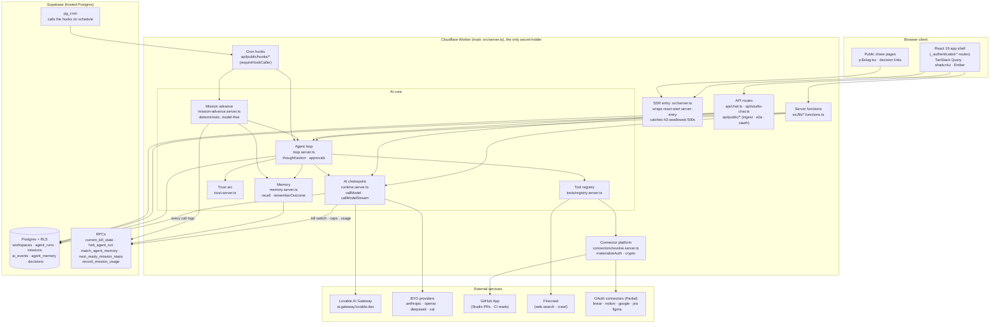
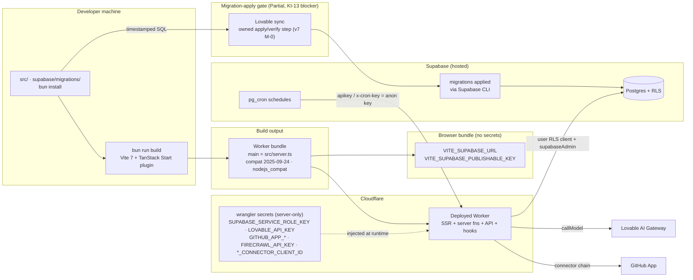
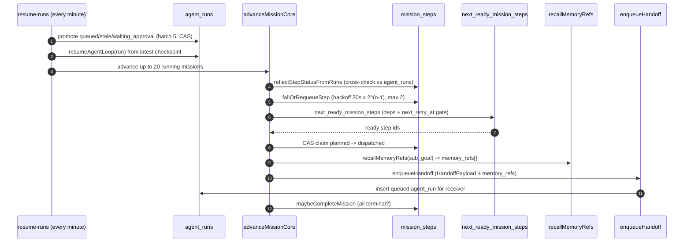
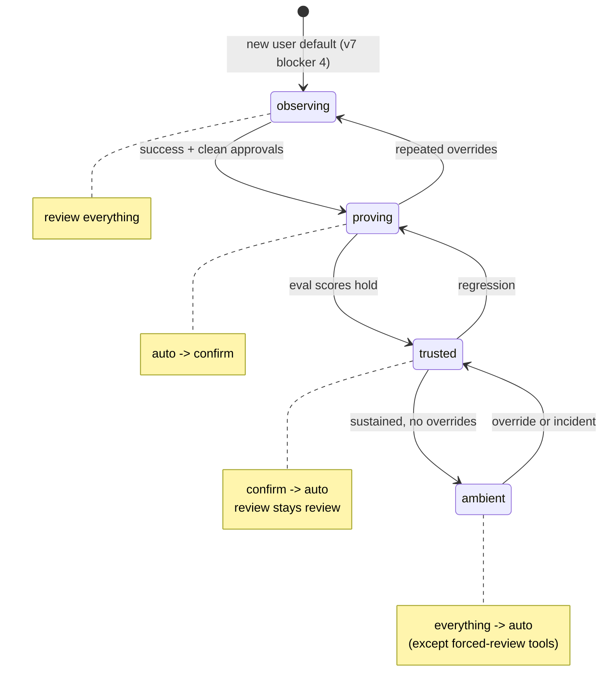
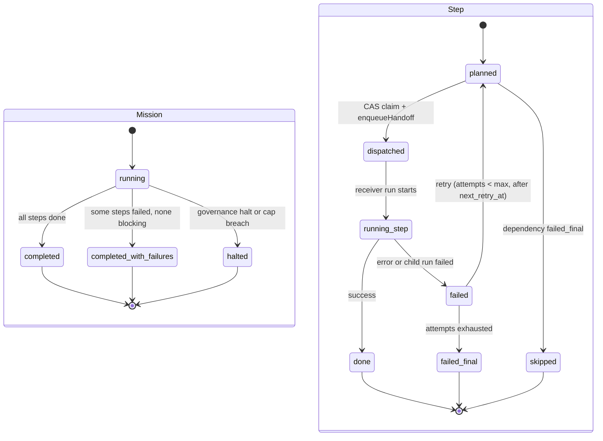

# architecture/diagrams.md: the visual companion to the architecture contracts

> **What this is.** The picture book for Circuit (the project formerly known as Cadence). Every diagram here is Mermaid, lives in git as text, and renders the wiring described in prose by the sibling contracts: [`runtime.md`](./runtime.md) (the AI chokepoint), [`orchestration.md`](./orchestration.md) (missions and the loop), [`data.md`](./data.md) (tables and RLS), [`security.md`](./security.md) (tenancy, kill switch, secrets), [`integrations.md`](./integrations.md) (the connector platform), and [`frontend.md`](./frontend.md) (the app shell). Strategy canon for what we are building and why: [`../docs/strategy/v7-agentic-product-os-2026-06-14.md`](../docs/strategy/v7-agentic-product-os-2026-06-14.md). Rules: [`../AGENTS.md`](../AGENTS.md).
>
> **Honesty rule (claim-never-outruns-wiring).** Each diagram is tagged against `main` as of 2026-06-14. A node is **Built** when it runs in code, **Partial** when it exists but is gated or incomplete, **Missing/Planned** when it is roadmap. The legend in each section calls out what is not yet real, so a screenshot of this doc never over-promises. The verified state of the engine is in v7 §2.

---

## How to read these

Several focused diagrams beat one wall-sized one. The set covers, in order: the system and its containers, the deployment topology, the data model, the key runtime flows as sequences, and the two lifecycles that govern trust and missions. Where a node is gated or unbuilt, it is labeled in-diagram and listed under the diagram. The four blockers from v7 §2 (the orchestrator slug bug, the migration-sync gate that keeps live signup 500-ing, connectors OAuth-wired but not operational, and `observing`-by-default) are marked wherever they touch a node.

---

## 1. System and container view (C4-style)

The whole product is one Cloudflare Worker plus a Supabase project. The browser talks only to the Worker; the Worker is the single process that renders SSR, runs server functions, hosts the public API and cron hooks, and is the only thing that holds secrets. Every AI call in the system funnels through one module (`runtime.server.ts`), and every multi-step workflow funnels through one loop (`loop.server.ts`). That double chokepoint is the spine of the architecture.



**Build status.** The Worker, the chokepoint, the loop, the deterministic advance, memory, the trust arc, the tool registry, and the Supabase wiring are all **Built**. The Lovable gateway path, BYO routing, the GitHub App, and Firecrawl are **Built**. OAuth connectors beyond GitHub are **Partial** (wired in the registry, not operational pending founder OAuth-client registration, so SENSE is webhook-only in practice). The public share pages are **Built** with column-scoped anon grants (see KI-17 in [`security.md`](./security.md)).

---

## 2. Deployment topology

One build command produces one artifact: a Cloudflare Worker bundle. Vite (with the TanStack Start plugin) compiles the app and reroutes the SSR entry to `src/server.ts`; `wrangler.jsonc` points `main` at it with `nodejs_compat`. Secrets live as wrangler secrets and never enter the client bundle; only the two `VITE_`-prefixed Supabase values are browser-safe. Schema changes ride a separate path: timestamped SQL in `supabase/migrations/`, applied through the Supabase CLI driven by Lovable sync. That apply step is the gate that currently blocks live signup (KI-13).



**Build status.** The build path, the Worker deploy, the secret split, and the hosted Supabase wiring are **Built**. The migration-apply gate is **Partial**: six 2026-06-14 migrations are unapplied on live, which is why a real account still 500s on signup. v7 M-0 makes this an owned apply-and-verify step rather than a passive wait on Lovable. The cron caller secret is the anon key reused as a shared secret between pg_cron and the Worker (`requireHookCaller`).

---

## 3. Data-model ERD (core tables)

Grounded in `supabase/migrations/` (timestamped, RLS-aware) and `src/integrations/supabase/types.ts`. `workspaces` is the multi-tenancy anchor: every table carrying `workspace_id` is RLS-scoped to membership. This ERD shows the spine, not every column. The full column contracts live in [`data.md`](./data.md). Two tables (`decisions`, `prototypes`) carry hardened column-scoped anon grants for public sharing (KI-17, [`security.md`](./security.md)).

```mermaid
erDiagram
    workspaces ||--o{ agent_runs : scopes
    workspaces ||--o{ missions : scopes
    workspaces ||--o{ ai_events : scopes
    workspaces ||--o{ decisions : scopes
    workspaces ||--o{ signals : scopes
    workspaces ||--o{ event_queue : scopes
    workspaces ||--o{ connection_bindings : scopes
    workspaces ||--o{ agent_messages : scopes

    profiles ||--o{ agents : owns
    profiles ||--o{ ai_budgets : has

    agents ||--o{ agent_runs : executes
    agents ||--o{ agent_autonomy : "arc dial"
    agents ||--o{ agent_memory : "scoped memory"

    missions ||--o{ mission_steps : "DAG nodes"
    missions ||--o{ agent_runs : "groups runs"
    missions ||--o{ agent_messages : "A2A within"
    missions ||--o{ decisions : "auto-captures"

    mission_steps }o--|| agent_runs : "run_id at dispatch"

    agent_runs ||--o{ agent_run_checkpoints : "per-step state"
    agent_runs ||--o{ agent_approvals : "gated tool calls"
    agent_runs ||--o{ tool_calls : "executions"

    ai_events ||--o| ai_evals : "judge scores"
    ai_events ||--o{ guardrail_hits : "rule matches"
    ai_events ||--o{ ai_events : "parent_event_id"

    guardrail_rules ||--o{ guardrail_hits : produces

    signals ||--o{ event_queue : "reactor fanout trigger"
    event_subscriptions ||--o{ event_queue : routes
    ingest_tokens ||--o{ signals : "webhook auth"

    connections ||--|| connection_secrets : "AES-256-GCM"
    connections ||--o{ connection_bindings : "workspace resource"

    missions ||--o{ studio_changesets : "Build staging"
    studio_changesets ||--o{ studio_changes : "per-file diffs"
    studio_changesets ||--o{ builder_file_claims : "path locks"

    prds ||--o{ learnings : "recorded outcomes"
    agent_memory ||--o{ learnings : "rememberOutcome distils"

    workspaces {
        uuid id PK
        text name
    }
    agent_runs {
        uuid id PK
        uuid workspace_id FK
        uuid mission_id FK
        text status "queued/running/waiting_approval/halted/..."
        int step_index
        numeric spend_used_usd
        numeric mission_spend_cap_usd
    }
    missions {
        uuid id PK
        text status "running/completed/completed_with_failures/halted"
        int hop_count
    }
    mission_steps {
        uuid id PK
        int idx
        text agent_slug
        int_array depends_on
        text status "planned/dispatched/running/done/failed/skipped"
        int attempts
        timestamptz next_retry_at
    }
    agent_memory {
        uuid id PK
        text scope "agent/global"
        text kind "note/reflection/outcome_memory"
        int importance
        vector embedding
        timestamptz last_used_at
    }
    ai_events {
        uuid id PK
        text surface
        text trace_id
        uuid parent_event_id
        numeric est_cost_usd
        text status "ok/error/blocked"
    }
    decisions {
        uuid id PK
        text share_slug "CSPRNG, unique"
        bool is_public "anon-read only when true"
    }
```



**Build status.** Every table above is **Built** and present in migrations. The orchestrator slug bug lives in data terms here: `mission_steps.agent_slug` values planned by the orchestrator name agents that are not seeded in `agents.slug`, so `mission.plan` slug validation throws before rows are inserted (v7 §2 blocker 1). `agent_memory.embedding` recall depends on the COALESCE scope-fix migration landing; until then the autonomous path recalls reflections only, not semantic memory.

---

## 4. Sequence diagrams (the key flows)

### 4a. Ingest webhook to decision card to approve to execute

The felt loop. A signal arrives by webhook, a trigger fans it into the event bus, the reactor dispatches an agent, the agent proposes a write that lands in the approvals queue and surfaces as a Today card, the operator approves, and the cron executes the tool. The human makes the call; the loop does the reversible work around it.

```mermaid
sequenceDiagram
    autonumber
    participant Ext as External source
    participant API as api/public/ingest-signals
    participant DB as Postgres
    participant React as event-reactor-tick (cron)
    participant Loop as runAgentLoop
    participant RT as callModel
    participant Today as Today queue (UI)
    participant Op as Operator
    participant Appr as approvals-tick (cron)

    Ext->>API: POST signals (Bearer ingest_token)
    API->>DB: insert signals (explicit workspace_id)
    DB->>DB: signals_reactor_fanout trigger -> event_queue (pending)
    React->>DB: drain event_queue (approval_mode='auto', batch 10)
    React->>Loop: dispatchEvent -> runAgentLoop(target_agent_slug)
    Loop->>RT: thought/action step (surface='agent')
    RT-->>Loop: action = tool_call (write tool)
    Loop->>DB: insert agent_approvals (status='pending')
    Note over Loop,DB: write tool + confirm/review mode -> gated
    Today->>DB: read pending approvals
    Today-->>Op: "Waiting for your call" card + CriticBadge
    Op->>DB: approve (status='approved', decided_by)
    Appr->>DB: read approved approvals
    Appr->>Loop: executeApproval(stored args)
    Loop->>DB: tool runs -> status='executed', result
    Note over Today,Op: card flips to "Executed & learned" (+ 1-click undo)
```

**Build status.** Webhook ingest, the fanout trigger, the reactor drain, the approvals queue, `executeApproval`, and the Today decision card with `CriticBadge` are all **Built**. The "Executed & learned" / unattended-execution audit is **Built** (`isSideEffectingTool` marks `is_unattended`). New users land on `observing`, so by default everything gates here (v7 §2 blocker 4); the ambient on-ramp that grows the green share is **Partial**.

### 4b. The agent thought-and-action loop

One run, step by step. Each step checkpoints its state so a Worker eviction is recoverable, reads operator steer messages, calls the model for a `{thought, action}`, and either runs a tool (idempotently, with the result wrapped as untrusted) or finishes. Governance is checked inside `callModel` before any spend.

```mermaid
sequenceDiagram
    autonumber
    participant Loop as executeLoop
    participant CP as agent_run_checkpoints
    participant Msg as agent_messages (steer)
    participant RT as callModel
    participant Gov as kill switch + caps
    participant Reg as TOOL_REGISTRY
    participant Tool as tool impl
    participant Mem as autoReflect

    loop up to adaptiveStepBudget (cap 40)
        Loop->>Msg: read unconsumed steer -> inject
        Loop->>CP: upsert checkpoint (run_id, step_index)
        Loop->>RT: callModel(json_object, promptKey='planner_executor')
        RT->>Gov: current_kill_state + checkMissionCaps
        alt halted
            Gov-->>RT: GovernanceHaltError
            RT-->>Loop: throw -> run status='halted' (skip reflect)
        else ok
            RT-->>Loop: {thought, action}
        end
        alt action = tool_call
            Loop->>Reg: validate name + Zod + safety floor
            alt confirm/review mode
                Loop->>CP: checkpoint -> status='waiting_approval' (return)
            else auto
                Loop->>Tool: withIdempotency(tool:runId:step:name)
                Tool-->>Loop: result (wrapped <untrusted_tool_output>)
            end
        else action = final
            Loop->>Mem: autoReflect + maybeAutoAdvanceArc + maybeCompleteMission
        end
    end
```

**Build status.** All **Built**: adaptive step budget (`budget.ts`), per-step checkpointing, steer injection, the safety-floor approval composition (`HIGH_RISK_FORCE_REVIEW`, `HIGH_RISK_MIN_CONFIRM`), idempotent tool execution, the untrusted-output wrapping (prompt-injection defense), and auto-reflection. The governance halt path is **Built** end-to-end through `runtime.server.ts` (see [`runtime.md`](./runtime.md) step 0).

### 4c. Deterministic auto-advance (the resume-runs cron)

This is the part that makes the loop run itself, with no model in the path. Every minute, `resume-runs` promotes stalled runs and then calls `advanceMissionCore`, which reconciles step status against real run status, dispatches dependency-ready steps with a claim-first compare-and-swap, threads recalled memory into the handoff, and completes the mission when everything is terminal.



**Build status.** All **Built**. This is the verified core from v7 §2: deterministic, model-free advance past wave-0; phantom-guarded `memory_refs` threaded into each hop; bounded retry with exponential backoff; claim-first CAS so concurrent ticks never double-dispatch. The slug bug (4b/3) blocks this from running on a real multi-agent mission until fixed, but the machinery itself is real.

### 4d. The Studio (Build) stage to commit to PR to CI to merge loop

The green path that ships real code. The most complete station. Files are staged into a changeset, committed to an isolated branch, a PR is opened, CI is read, and merge is gated behind a forced review. Three of these tools pause the run on approval so the operator decides the irreversible ones.

```mermaid
sequenceDiagram
    autonumber
    participant Loop as agent loop (builder)
    participant Claim as builder_file_claims
    participant CS as studio_changesets / studio_changes
    participant GH as GitHub App
    participant Appr as agent_approvals + cron
    participant Op as Operator

    Loop->>Claim: acquire per-repo per-path lock (held)
    Loop->>CS: studio.stage (deny-list + base_sha)
    Note over Loop,CS: studio.commit -> PAUSE_ON_APPROVAL + min confirm
    Loop->>Appr: insert approval -> status='waiting_approval'
    Op->>Appr: approve commit
    Appr->>GH: studio.commit (FNV-1a content fingerprint idempotency)
    GH-->>CS: status='committed', base branch
    Note over Loop,GH: studio.pr.open -> PAUSE_ON_APPROVAL
    Op->>Appr: approve PR
    Appr->>GH: open PR -> pr_url, pr_number, status='pr_open'
    Loop->>GH: github.ci.read (poll checks)
    Note over Loop,GH: studio.pr.merge -> HIGH_RISK_FORCE_REVIEW (always review)
    Op->>Appr: approve merge
    Appr->>GH: merge PR -> status='merged'
    Appr->>Claim: release locks
```

**Build status.** All **Built**: file-claim locks, the path deny-list (`.github/`, `supabase/migrations/`, `.env`, lockfiles), content-aware commit idempotency, the PR lifecycle, CI reads, and the forced-review merge gate. GitHub credentials resolve through the connector chain (`resolveGitHub`); see [`integrations.md`](./integrations.md).

---

## 5. State diagrams

### 5a. The trust arc

The autonomy dial per agent, set by the operator and nudged by earned trust. It runs observing → proving → trusted → ambient, and the arc composes with each tool's own mode through a safety floor (`resolveApprovalMode`) that never loosens a `review` tool. Real new users start at `observing` (gate everything); demo accounts seed `trusted`. Note that `trusted` is not `ambient`: it auto-runs confirm-gated tools but still gates review tools.



**Build status.** The arc, the safety-floor combiner, the Bayesian trust score (`computeAllAgentTrust`, shrunk toward 0.5), and `maybeAutoAdvanceArc` are **Built**. The arc dial lives in `agent_autonomy`. The honest, visible on-ramp that makes the felt experience progressively ambient (the v7 §7 reframe) is **Partial**: mostly defaults and UX, not new architecture.

### 5b. Mission and step lifecycle

Two nested machines. A mission moves from running to a terminal verdict; each step inside it moves through plan, dispatch, run, and a terminal outcome, with retry looping a failed step back to planned until the attempt budget is spent. The deterministic advance in 4c drives both.



**Build status.** Both **Built**. Mission terminal states and step states match the `missions.status` and `mission_steps.status` enums in migrations. Retry backoff and the attempt ceiling come from `retry.ts` (default max 2, `30_000 x 2^(attempts-1)`). `maybeCompleteMission` fires when no unconsumed handoff messages remain and every step is terminal, and it auto-captures a `decisions` row.

---

## Related

- [`runtime.md`](./runtime.md): the AI chokepoint contract (the pipeline behind every `callModel` node above).
- [`orchestration.md`](./orchestration.md): missions, the loop, parallelism, and approval routing in prose.
- [`data.md`](./data.md): full column contracts and RLS for every table in the ERD.
- [`security.md`](./security.md): tenancy, the two-level kill switch, KI-17 anon grants, secrets, idempotency.
- [`integrations.md`](./integrations.md): the connector registry and the `resolveProviderAuth` credential chain.
- [`frontend.md`](./frontend.md): the app shell, routes, and the Today queue that renders the decision cards.
- [`../docs/strategy/v7-agentic-product-os-2026-06-14.md`](../docs/strategy/v7-agentic-product-os-2026-06-14.md): the current positioning and build canon, including the verified state and the four blockers.
- [`../plan.md`](../plan.md): the build log and milestone roadmap.
