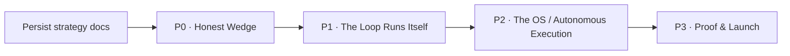

# v6: Cadence as the **Agentic Product OS** (positioning + build canon)

> **Status:** canonical strategy / positioning source of truth as of 2026-06-13. Supersedes the v5
> Chief-of-Staff overlay as the **wedge + positioning** doc; v4 (`v4-feature-map-2026-06-11.md`)
> remains the **expansion / engine map** (the 19-agent mesh, 7 laws, 6 stations). Personas trace to
> v3; this doc refines them.
> **Author:** Claude (technical co-founder / CTO, per `Ai_Cofounder.md`).
> **Naming:** product name not finalized; **Cadence ≡ Circuit** everywhere (see CLAUDE.md disclaimer).
> **Method:** 3 internal-lens explorations (surfaces · strategy canon · runtime reality) + 3
> market-research streams (competition · customer pain · UX/pricing/GTM) + a 5-seat pressure test
> (CTO red-team · CEO/GTM · investor · principal-PM · AI-architect). Every code-level claim below was
> verified against the repo on 2026-06-13; sharp edges are flagged ⚠️. Findings + sources: Appendices
> A to D. Competitive detail: [`docs/references/competitive-landscape-2026-06-11.md`](../references/competitive-landscape-2026-06-11.md).

---

## 1. Context: why this doc exists

If this product is run by an agent ecosystem, why does it still wear the clothes of a human PM tool
(a "Plan next 2 weeks" sprint button, a To-Do/Doing/Done kanban, capacity-hours)? Why does it show
*everything* instead of only the decision a human must make? And what should we be, positioned,
priced, sequenced, and built, to win the market as it actually is in mid-2026?

The honest finding: **our engine is real and good, our story over-claims relative to what's wired
today, and our UI contradicts our story.** Founder ruling: the *ambition*, autonomous end-to-end
execution of the whole product lifecycle, is non-negotiable and correct. This doc keeps that
ambition as the North Star and fixes the two things that betray it: the human-PM-legacy UI, and the
gap between *claimed* autonomy and *wired* autonomy (closed with real engineering, not messaging).

---

## 2. The verdict: where the founder is right, where to course-correct

### RIGHT (validated; keep)
1. **Agentic-first and genuinely autonomous**, not a chatbot/copilot, not consolidate-and-advise.
   The system must *execute end-to-end on its own*. (Gartner: 40% of enterprise apps embed agents by
   end-2026.)
2. **Model-agnostic + BYOK; the moat is workflow+memory+execution, not the model.** Table stakes that
   *enables* the moat.
3. **Smallest-viable-entry → PM wedge first, full OS as the destination.** Wedge-first beats
   platform-first. (Position = the OS umbrella; entry = the PM ritual, §3.)
4. **"Simple front, powerful engine."** Approve-by-exception, one daily ritual, hide the engine room.
5. **The closed loop + compounding memory**, the genuinely defensible idea and the market's true
   whitespace. No credible player owns the *governed, autonomous closed loop*.

### COURSE-CORRECT (accepted, ruling §10-#5)
1. **Don't *claim* more autonomy than is *wired*, at each phase.** A discipline, not a retreat. The
   market punishes hollow claims (enterprise AI abandonment 17%→42% in a year; trust in AI accuracy
   29% vs 40%; Gartner: 40% of agentic projects cancelled by 2027). Today the runtime pauses at every
   ship gate, defaults new agents to "review-everything," and needs a human to re-launch each mid-loop
   hop (Appendix B). **Build real autonomy aggressively; let messaging mature in lockstep.** Anthropic:
   auto-approve rises 20%→40% as trust is earned. The trust-dial is the on-ramp, not a cap.
2. **The 19-agent mesh as a user-facing concept is a liability.** Ship **~5 agents users meet through
   their output**; keep the 19-mesh as the engine/expansion map.
3. **"Users build their own agents": right vision, wrong timing.** Defer the marketplace; **preserve
   the A2A handoff contract** so it's a config surface later, not a rebuild.
4. **The 2-week sprint / kanban / capacity-hours contradict the pitch. Delete them.**
5. **The OS position wins *vertically*, not by bundling.** We win as the **vertical, opinionated,
   governed system-of-record + memory that closes the loop and delegates execution to best-of-breed
   agents**, not by rebuilding Devin/ChatPRD/Productboard. "OS" = it runs the lifecycle and
   orchestrates execution; it does not re-implement every tool.
6. **Not a "neutral orchestration/memory control plane"**: that's the most commoditized layer
   (crushed between the labs, Linear's agent rail, and point-tool MCP servers). The OS must be
   vertical, opinionated, governed, never neutral middleware.

---

## 3. Positioning: the Agentic Product OS

**Umbrella:** **Cadence is the Agentic Product OS, the autonomous operating system for the entire
product lifecycle.** Connected to your sources, a mesh of specialist agents runs the loop end-to-end:
sense → decide → define → build → launch → learn, executing the work itself under governance. You set
direction and make the calls only you can; the system does the rest, and gets sharper every cycle.

Two pillars under the umbrella:
- **Pillar 1, PM Chief of Staff (felt entry):** the daily ritual. Overnight, agents read everything;
  each morning you get the **2 to 3 calls that need your judgment**, each with cited evidence + a Critic
  challenge + the drafted artifact that follows. The wedge: value in <10 min.
- **Pillar 2, Decision System (the moat):** evidence in, decisions out, **memory that compounds.**
  Every decision + outcome is remembered and re-scores future priorities. The defensible record
  competitors can't clone by shipping a model.

**Thesis:** it does **not** stop at consolidating inputs and telling you what to do. **It executes.**
Chief-of-Staff ritual = front door; Decision System = spine; autonomous end-to-end execution = engine
and destination. The human's supervision burden *shrinks as trust compounds*.

**One-liner (draft):** *"Cadence is the Agentic Product OS: it runs your product's entire lifecycle,
sensing signals, deciding priorities, drafting specs, shipping code, launching, and learning,
autonomously, under your governance. You make the calls only you can; it does the rest, and remembers
everything so it gets sharper every cycle."*

**One rule:** the claim never outruns the wiring.

**Beachhead persona:** the **senior / founding PM at a 50 to 400-person B2B SaaS company**, owns an area,
buyer *and* user, AI power user, shows up daily for the ritual. Tip of the spear: AI-native-startup
product owners (Lenny's + X). Founders/CEOs are secondary expansion.

---

## 4. What to DELETE / HIDE / BUILD (grounded to real files)

### DELETE (contradict the OS positioning)
- **Sprint button + sprint-plan preview + capacity-hours**: `src/components/product/RoadmapPanel.tsx`
  ("Plan next 2 weeks" + "AI rebalance" buttons, ember sprint-preview, capacity math). Server fns:
  `planSprint` + `rebalanceRoadmap` in `src/lib/roadmap.functions.ts`.
- **To-Do / Doing / Done kanban + human/agent assignee toggle**: `src/components/product/TasksPanel.tsx`.
- **"AI rebalance" as an *optional* button**: continuous re-ranking becomes default; human reviews,
  doesn't trigger.
- **Standalone Briefing route**: finish merge to Settings (`src/routes/_authenticated.briefing.tsx`).
- **Route sprawl** (~43 `_authenticated.*` routes): ⚠️ most are *already* mothballed/redirecting; do
  **not** mass-delete route files.

> ⚠️ **Flag (Today vs. Tasks):** the DELETE targets the **product-tab kanban + sprint planner**. But
> **Today** (`src/routes/_authenticated.index.tsx`) has its *own* simple task-capture list (local
> `TasksPanel` at :1249) and "Tasks shipped / In flight" tiles reading the same `tasks` table
> (:782-792, :846). A cascade-delete of the `tasks` table/server fns breaks Today. **Recommendation
> (ruling intact):** delete the product-tab kanban + sprint planner now; keep the `tasks` table and
> Today's capture list until the BUILD dependency-graph replaces the executor framing.

### HIDE (engine room / Trust drawer / progressive disclosure)
Govern's tabs → one **Engine Room** behind a **Trust drawer** · agent config + full roster → simple
sheet (5 names) · evals/drift/prompts/budgets → engine room · traces → reachable from any artifact ·
Build/Studio canvas → behind the mission · model routing/BYOK → Settings with smart defaults.

> ⚠️ **Flag (mostly already done):** the nav is **already** cut to Product/Missions/Knowledge with a
> Trust-row footer that is the only engine-room path (`src/components/cadence/AppShell.tsx:79-116`,
> F-V5-MOTHBALL). HIDE work remaining is small: ensure deletions leave no dangling `/product?tab=`
> links and the Trust row resolves.

### BUILD / FIX
- **Replace sprint/kanban** with the **agent-decomposed dependency graph + live status** ("Builder is
  shipping A, B, C"). ETA only once a real estimate field exists (no faking).
- **The decision-first card**: highest-leverage UI; spec in Appendix D. ⚠️ **It enriches the
  *existing* calls queue** (`getNeedsYou` → `src/lib/today.functions.ts`, rendered at
  `index.tsx:418-597`), not a greenfield build.
- **Cold-start on-ramp**: a brand-new workspace lands on an empty Today; narrated empty state that
  *is* the on-ramp ("forward me your last 20 pieces of feedback and I'll surface your first calls").
- **Make memory + the loop visible**: Memory Context pill + loop-closure re-score. ⚠️ The re-score
  **already happens** in `src/lib/outcome.functions.ts:200-253` (writes `learnings` `prior_ice`→
  `new_ice`, re-scores the opportunity); surface it, don't rebuild it.
- **Close the autonomy gap** (Phase 1 to 2): event-reactor auto-handoff across mid-loop hops, hop-failure
  retry/recovery, adaptive step budgets, execution-delegation under governance.

---

## 5. Default agents & ecosystem sequencing

- **Ship now (5, met through output):** Scout (senses) · Strategist (ranks) · Critic (challenges) ·
  Scribe (drafts) · Chief of Staff (orchestrates; UI name for Orchestrator).
- **Engine/expansion map (not user-facing):** the full 19-agent mesh (Listener, Researcher, Quant,
  Designer, Planner, Studio, Inspector, Releaser, Marketer, Pricer, Support, Historian, Reactor).
- **Defer (platform phase):** user-built agents + marketplace + open MCP/A2A, **but preserve the
  `HandoffPayload` contract now** and add the missing `memory_refs[]` field
  (`src/lib/ai/handoff.server.ts`).
- **Implementation:** map internal agent slugs → the 5 user-facing names at the **display layer only**
  (`src/lib/agent-vocabulary.ts`). ⚠️ **Do not rename DB slugs**: follow the repo's rename-disclaimer
  pattern (internal identifiers stay).

---

## 6. Autonomy: North Star + the honesty rule

- **North Star:** genuine **autonomous end-to-end execution** of the lifecycle. Not advice, execution.
- **On-ramp:** the trust-arc (`src/lib/ai/trust.server.ts`): observing → proving → trusted → ambient.
  Day one is supervised; autonomy *earns its way up* as success/approval/eval scores compound.
- **Honesty rule:** at every phase, **claim only what's wired.**
- **The engineering that earns the claim:** event-reactor auto-handoff, retry/recovery on hop failure,
  adaptive step budgets, execution-delegation under governance.
- **Demo seed:** seed demo agents at **`trusted`** (not `ambient`). ⚠️ `loadAgentArc` returns
  `observing` when **no** `agent_autonomy` row exists (`trust.server.ts:194`); seeding `trusted` means
  **inserting** `agent_autonomy` rows (`setAgentArc`, `src/lib/trust.functions.ts:46`); a missing row
  silently means "review everything."

---

## 7. Pricing & GTM

### Pricing
- **Free:** 1 workspace, ritual capped, webhook ingest, decision log ~30 days, capped agent spend.
  *Memory expires* → the paid pull.
- **Pro, $39/mo** ($29 early-bird; $390/yr). Unlimited ritual, **full persistent decision memory
  (never expires)**, unlimited ingest, Critic everywhere, shareable decision links, transparent overage
  ceiling. **Charge for memory persistence, not per agent-run.**
- **Team, $59 to 79/seat/mo.** Shared memory, per-role approval lanes, usage metering + BYOK.
- **Enterprise, custom (later).** SSO/audit/residency/governance; outcome-based.
- **Principle:** subscription + hard overage ceiling for the wedge; reserve usage-based + BYOK for
  team/enterprise. Per-seat is dying (21%→15%); hybrid is the team path.

### GTM: first 100 paying (solo founder, no sales team)
1. **Pre-launch:** 15 to 25 hand-picked design partners, free + weekly feedback; **≥8 must pipe REAL data.**
2. **Launch:** Lenny's community/Slack + build-in-public on X (lead with the *Critic* red-teaming a pet
   feature) + Product Hunt + r/ProductManagement. Ship a **shareable decision link** as the viral loop.
3. **Convert:** free→Pro paywall on *memory persistence + ritual continuity*; "anonymized decisions of
   the week" content; design-partner referrals. ~100 paying **iff** time-to-value <10 min on real data.
- **Do NOT:** cold outbound, "book a demo" gating, enterprise pilots, two GTM motions at once.

---

## 8. Defensibility & the proof gauntlet

Today's product lands in the **tooling framing ($5 to 10M)**; the **labor framing ($100M+)** requires the
autonomous-execution + compounding-memory half. **The OS ambition moves us from tooling-scale to
labor-scale, only if the autonomy and memory are real, not slideware.**

**Proof gauntlet (instrumented from Phase 0, runs alongside the build, gated near the end of the
~45-day envelope, no fixed calendar date):**
1. **Willingness-to-pay:** ≥10 PMs paying **≥$150/mo**.
2. **The loop closes once, for real:** a signal cluster on a *real* customer's data re-ranks *their*
   roadmap with zero manual transport; a shipped spec gets an outcome review that moves a downstream
   priority.
3. **Autonomy ticks up on a real account:** something they let the agent do unattended later that they
   gated at first.
4. **Recruit ahead of the round:** a credible second hand (technical or GTM).
- **North-star metric:** **Calls-queue acceptance rate** + **real-data ritual retention** + **autonomy
  ratio trending up.** Go/scale gate when the gauntlet clears, not on a date.

**Ranked moat threats:** (1) foundation labs add native memory/orchestration (existential; defense =
PM-domain depth + governance, ~18-mo head start); (2) Linear/Notion/Productboard add the loop as a
feature; (3) ChatPRD distribution; (4) funded fast-follower.

---

## 9. Phased build: continuous, sequenced, no hard dates

> **Founder ruling:** **no calendar deadlines, no August date.** Build continuously; each phase is
> picked up the moment the prior phase's demoable milestone lands. Overall **intent: close within ~45
> days**, expressed as a sequence of demoable milestones (~every 2 weeks), not a fixed date. Compress
> on fast proof; extend if real-data feedback demands it. Momentum lives in the milestone cadence.

### Phase 0: Honest Wedge ("the Chief of Staff is real")
Dependency order: W1 → W2 → W3 → {W4, W5} → W6.
- **W1, DELETE:** remove `RoadmapPanel.tsx` + `TasksPanel.tsx`; strip `roadmap`/`tasks` from the
  `Tab` union / `TABS` / `PRODUCT_DESC` / imports / render branches in
  `src/routes/_authenticated.product.tsx`; delete `planSprint`+`rebalanceRoadmap`; repoint/remove
  `?tab=roadmap|tasks` links + `["roadmap"]` invalidations. ⚠️ Today-tiles flag (§4).
- **W2, Vocabulary:** `src/lib/agent-vocabulary.ts` slug→5-name map, applied at render only.
- **W3, Decision-first card:** new `src/components/today/DecisionCard.tsx` (Appendix-D); replace the
  three inline row blocks in `index.tsx`; reuse `CriticBadge`; extend `getNeedsYou` + `NeedsYou`.
- **W4, Cold-start on-ramp:** narrated empty Today gated on real emptiness.
- **W5, Memory visible:** surface the `outcome.functions.ts` re-score (Memory pill + Today line); add
  `memory_refs[]` to `HandoffPayload` + thread it through.
- **W6, Demo seed @ trusted:** insert `agent_autonomy` rows at `arc='trusted'` for the demo account; a
  real overnight mission.

### Phase 1: The Loop Runs Itself ("autonomy, wired")
Event-reactor auto-handoff across mid-loop hops; hop-failure retry/recovery; adaptive step budgets; a
supervised end-to-end mission demonstrably runs. (`src/lib/ai/loop.server.ts`, `handoff.server.ts`.)

### Phase 2: The OS / Autonomous Execution ("it executes, end-to-end")
Execution-delegation under governance; memory compounding proven + demoable; OS framing/IA; A2A
contract hardened.

### Phase 3: Proof & Launch ("right product, in market")
Real-data design-partner hardening; gauntlet instrumentation; pricing + shareable-decision viral loop;
public launch. Gate on the §8 gauntlet, not a date.

---

## 10. Founder rulings (locked 2026-06-13)
1. **Position = Agentic Product OS (umbrella)** = PM Chief of Staff (felt entry) + Decision System
   (moat). Must *execute end-to-end autonomously*. (§3)
2. **Ecosystem:** defer build-your-own-agents/marketplace; **preserve the A2A contract.** (§5)
3. **Timeline:** **no hard dates / no August deadline.** Continuous, phase-sequenced; demoable
   milestone ~every 2 weeks; **~45-day envelope as intent**, compress/extend on proof. (§9)
4. **Beachhead:** senior/founding PM at 50 to 400-person B2B SaaS. (§3)
5. **Course-corrections accepted:** the §2 set (incl. 5 agents met-through-output +
   claim-never-outruns-wiring).
6. **Naming:** unfinalized; **Cadence** placeholder (Cadence ≡ Circuit).
7. **Session method:** first executable unit = persistence (§11) + **full Phase 0**; refinement mode =
   **ground + flag risks**; this doc is the **full plan**, not a change-list.

---

## 11. Research persistence & standing context
- This doc is the canonical strategy. Competitive + pain + UX findings:
  [`docs/references/competitive-landscape-2026-06-11.md`](../references/competitive-landscape-2026-06-11.md).
- Rulings logged in [`session-decisions.md`](./session-decisions.md); `Ai_Cofounder.md` Repo
  Concordance updated for the OS-position shift.
- Read-order pointers to this doc live in `CLAUDE.md`, `AGENTS.md`, `GEMINI.md`, `.lovable-config.txt`.

---

# Appendix A: Competitive landscape (mid-2026, sourced)
**Arc:** 2024 copilot → 2025 autonomous agents → **2026 orchestration & governance.** Gartner: 40% of
enterprise apps embed agents by end-2026 (from <5%); **40% of agentic projects cancelled by 2027.** MCP
~97M monthly SDK downloads, 5,800+ servers; MCP+A2A table stakes. "Agent sprawl" is the named pain (avg
12 agents/company; ~50% isolated).
**Players by station (each owns ONE; no end-to-end owner):** *Build*: Devin/Cognition, Factory ($1.5B),
Cursor, GitHub Copilot Agent (GA), Replit ($253M ARR), v0/Vercel, Claude Code. *Sense*: Enterpret,
Dovetail, Unwrap, Productboard signals. *Decide/Define*: ChatPRD (100k+ PMs, ships inside Linear),
Productboard AI, Notion AI (21k custom agents in beta, MCP-native). *Coordinate*: Linear for Agents
($1.25B), Atlassian Rovo, Height.
**Whitespace:** the **governed, autonomous closed loop with compounding memory** has no verified owner.
Defensible **only as a vertical, opinionated system-of-record / OS**, not neutral middleware.

# Appendix B: Runtime reality audit (the gap P1 to P2 closes), verified in code
- **Loop** (`loop.server.ts`): iterative {thought, action}; hard step caps (specialists ~6,
  orchestrator ~14, builder ~24); checkpoints each step.
- **Trust** (`trust.server.ts`): arcs observing→proving→trusted→ambient; **new agents default
  `observing` → every action review-gates** (`:159,:194`). `studio.pr.merge` always `review`.
- **Handoff** (`handoff.server.ts`): typed `HandoffPayload` (task/context/artifacts/constraints) but
  **no `memory_refs[]`**; mid-loop hops need the orchestrator re-invoked; **hop failure stops the
  mission, no retry** (file header).
- **Bottom line:** today the system **plans and scaffolds autonomously and gates execution**, not yet
  unattended end-to-end. P1 closes handoff/retry/budget; P2 adds governed execution-delegation.

# Appendix C: Customer pain & adoption (sourced)
- **#1 pain:** doc/status busywork; context-switching; loss of the evidence→decision thread.
- **Adoption killers:** AI outside existing workflows; trust/verification friction (accuracy trust
  40%→29%); config paralysis; over-scope (95% of GenAI pilots don't scale); **42% enterprise AI
  abandonment in 2025** (from 17%).
- **Accelerants:** embedded purpose-built agents (AtlantiCare 80% adoption, −42% doc time);
  **approve-by-exception > mandatory approval** (Anthropic auto-approve 20%→40%); **opinionated
  defaults > build-your-own**; transparency (citations) + reversibility (undo); one daily ritual; value
  in <10 min.

# Appendix D: Decision-first card spec (highest-leverage UI)
**Collapsed:** `the call as a question` → `evidence count + Critic verdict` (e.g., "12 signals · Critic:
revise, cannibalizes X") → `[Approve] [Open]`.
**Fields (priority):** 1) the call as a question; 2) cited, countable, click-through evidence; 3) Critic
challenge/verdict; 4) what-happens-if-I-approve (blast radius); 5) cost; 6) model (BYOK); 7)
undo/reversibility (say so when irreversible).
**Actions:** Approve (primary) · Reject (+reason; also blocks the agent's arc promotion) · Open ·
Defer/not-now (keeps the queue ≤3).
**Data sources (exist):** `agent_approvals`, `prds.critic_review`, `opportunities.critic_review`,
`ai_events` (spend), `agent_runs.model`.
**Memory-compounding requirements (later proof):** make `learnings` (`prior_ice`/`new_ice` + prd/opp
FKs) the demoable moat object; entity-link memory→the opportunity whose score moved; populate
`HandoffPayload.memory_refs[]`; ensure `last_used_at` write-back + decay.
